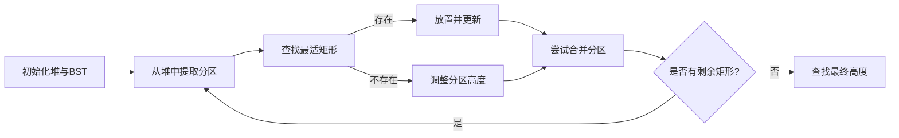

<center><strong>
    <span  style="font-size: 35px">Texture Packing</span>   
</strong></center>


<center>Date: 2024-12-2
</center>
<div style="page-break-after: always;"></div>

<strong>
    <span  style="font-size: 30px">目录</span>   </strong>

[TOC]

<div style="page-break-after: always;"></div>

# Chapter 1: Introduction

​	本项目研究的主题是`Textur Packing`。Texture Packing 问题是一类矩形装箱问题，常用于计算机图形学和游戏开发领域。其目标是将多个矩形形状的纹理 (texture) 紧密地打包到一个更大的矩形纹理中。具体来说，题目要求如下：

1. **输入**：若干矩形纹理，每个纹理有固定的宽度和高度。

2. **输出**：一个大的矩形纹理，其宽度固定，要求设计一种方法尽量减少所需的高度。

3. **限制条件**：大矩形纹理的宽度是给定的，最终纹理必须尽可能紧凑。


​	由于题目没有明确给出输入输出，在此介绍我们项目当中期望的输入输出格式：

### Input Specification(example)

```pseudocode
10 
5
4 3
3 2
6 5
5 3
7 1
```

> 首先读取的两个整型数字分别是大纹理（容器）的最大宽度以及小纹理（小矩形）的个数`n`；
>
> 接着为`n`行的小矩形数据，宽x高的格式依次输入。


### Output Specification(example)

```pseudocode
					.......
-------------------- Conclusion --------------------
Approximation ratio: 128.5714%
Final height dealing with 5 rectangles by Partition packing algorithm:9
```

> 1. `.......`表示的是依次插入小矩形的过程信息；
> 2. 最后分别输出`Approximation Ratio`与最终高度。其中`Approximation Ratio`采用算法得到的最终高度/最优解法的理想高度`optimal_height`, 后者通过`area_sum/container_width`得到，即将所有的矩形面积除以容器宽度。


- ##### 主要流程


<div style="page-break-after: always;"></div>


# Chapter 2: **Data Structure / Algorithm Specification**

## 2.1 结构体介绍

### 2.1.1 Texture 

```c
typedef struct {
    int width;
    int height;
} Rectangle;

// BST node structure
typedef struct TreeNode {
    Rectangle rect;
    struct TreeNode *left;
    struct TreeNode *right;
} TreeNode;
```

1. 为了表示存储单个`Texture`(下称小矩形)，我们定义结构体`Rectangle`，其内部属性分别为整形的宽与高；

2. 然后，我们将小矩形作为`BST`的节点根据属性`width`构造二叉树，方便后续根据宽度快速寻找符合条件的小矩形；


### 2.1.2 Partition

```c

typedef struct Partition {
    int start_index; // Starting x-coordinate
    int width;       // Width of the partition
    int height;      // Current height
    struct Partition *left;  // Pointer to left neighbor
    struct Partition *right; // Pointer to right neighbor
    int heap_index;           // Current index in the heap
} Partition;

// Min-heap structure for partitions
typedef struct {
    Partition **heap;  // Array of partitions
    int size;          // Current size of the heap
    int capacity;      // Maximum capacity
    int max_height;   // max_height of all partitions
} MinHeap;
```

1. `Partition`是我们表示大容器内部存储状态的结构体；
2. 分区`Partition`内部的属性功能简介如下：
   1. `start_index` ：该分区在容器当中的起始位置；
   2. `width`与`height`：分别表示该分区的宽度与高度；
   3. `struct Partition *left`与`struct Partition *right`：分别指向容器当中相邻的分区，方便在出入矩形后，合并相同高度的分区操作；
   4. `int heap_index`：用来存储在小顶堆中的实际索引。因为我们使用小顶堆方便取用最小宽度（用`width`来建堆），因此如果需要删除某个特定的节点时，利用该索引可以直接访问对应的节点，避免了遍历小顶堆的操作。
3. `MinHeap`的作用已经在`2`有所提及，也就是我们利用`Partition`作为堆的内部节点，并根据其`width`来建堆；其`max_height`属性用于存储当前容器当中所有分区的最大高度，在每次插入新的分区时更新，避免在最后以 $O(W)$ 的代价遍历小顶堆（$W$为容器宽度）。


- ##### 相关操作

  - 利用分区作为小顶堆的节点建堆（初始化为高度为0，宽度为`container_width`的分区），然后每次取用堆顶元素（宽度最小）
  - 在BST当中选择合适的小矩形插入到当前的位置，同时更新小顶堆中的分区：先调整其高度与宽度，然后检查是否需要合并；
  - 如果在第二步当中无法找到适合的小矩形，将该分区的高度设置为相邻区域的较小高度（表示弃用），合并之后然后继续搜索。

> 具体实现在`2.2`中给出。


## 2.2 主要函数介绍



> 在开始介绍函数前，请先了解整体流程（将在`2.3`中补充介绍）。

### 2.2.1 BST相关

- ##### 创建与插入节点

```pseudocode
Function CreateNode(Rectangle rect) Returns TreeNode*
    Create a new TreeNode object
    If memory allocation fails
        Output "Memory allocation failed!" error message
        Exit the program
    Set the node's rectangle to the provided rect
    Set the node's left and right children to NULL
    Return the newly created node
End Function

```

```pseudocode
Function Insert(root, Rectangle rect) -> TreeNode*
    If root == NULL
        Return CreateNode(rect)
    
    If rect.width < root.rect.width
        root.left = Insert(root.left, rect)
    Else
        root.right = Insert(root.right, rect)
    
    Return root
End Function

```

> 这部分与常规的BST操作相同：
>
> 1. 创建节点时提供矩形结构体作为节点的`rectangle`属性；
> 2. 插入时依据`width`进行排序。


- 寻找最合适的节点

```pseudocode
Function FindLargestFit(root, targetWidth) -> TreeNode*
    If root == NULL
        Return NULL
    
    result = NULL
    
    // If current node's width is greater than targetWidth, search the left subtree
    If root.rect.width > targetWidth
        result = FindLargestFit(root.left, targetWidth)
    Else
        // If current node fits, search the right subtree
        result = root
        rightResult = FindLargestFit(root.right, targetWidth)
        
        If rightResult != NULL AND rightResult.rect.width > result.rect.width
            result = rightResult
        End If
    End If
    
    Return result
End Function

```

> 这个函数是与传统BST查找的较大区别，因为我们需要查找的是**不大于`targetwidth`且宽度最大的矩形**。
>
> 1. 由于我们构建BST时，是利用矩形的`width`属性进行排序，因此我们在搜索时也利用这一属性；
> 2. 如果当前节点的`width`已经大于`targetwidth`，那么直接向其左子树继续搜索；
> 3. 如果当前节点的`width`小于等于`targetwidth`，将返回值`result`先赋值为当前节点`root`，然后继续在其右子树中寻找；
> 4. 递归逻辑如`2,3`步所示，如果找不到符合要求的节点，返回`NULL`。


- ##### 删除指定节点

```pseudocode
Function DeleteNode(root, Rectangle rect) -> TreeNode*
    If root == NULL
        Return NULL
    
    // Search for the node to delete
    If rect.width < root.rect.width
        root.left = DeleteNode(root.left, rect)
    Else If rect.width > root.rect.width
        root.right = DeleteNode(root.right, rect)
    Else
        // Node found
        
        // Case 1: Leaf node
        If root.left == NULL AND root.right == NULL
            Free root
            Return NULL
        
        // Case 2: Single child
        If root.left == NULL
            temp = root.right
            Free root
            Return temp
        
        If root.right == NULL
            temp = root.left
            Free root
            Return temp
        
        // Case 3: Two children
        // Find the smallest node in the right subtree
        successor = root.right
        successorParent = root
        
        While successor.left != NULL
            successorParent = successor
            successor = successor.left
        
        If successorParent != root
            successorParent.left = successor.right
        Else
            successorParent.right = successor.right
        
        // Copy successor's value to current node
        root.rect = successor.rect
        Free successor
    End If
    
    Return root
End Function

```

> 1. **递归查找节点**：首先递归查找待删除的节点。如果待删除的矩形宽度小于当前节点的矩形宽度，则向左子树递归；如果大于，则向右子树递归。
>
> 2. **节点删除的情况**：
>
> - **叶子节点**：如果当前节点没有左子树和右子树，则直接释放该节点并返回 `NULL`。
> - **单个子节点**：如果当前节点只有一个子节点，替换当前节点并返回该子节点。
> - **两个子节点**：如果当前节点有两个子节点，找到右子树中的最小节点（即右子树中最左的节点），用其值替换当前节点，并删除该最小节点。


### 2.2.2 Partition 相关

- ##### 维护堆的性质

```pseudocode
Function HeapifyUp(heap, index)
    While index > 0
        parent = (index - 1) / 2
        If heap[index].height < heap[parent].height
            Swap heap[index] and heap[parent]
            Update heap_index for swapped elements
         //Move up the heap
            index = parent
        Else
            Break the loop
        End If
    End While
End Function

```

> 从指定索引（`index`）开始，检查其父节点索引（`parent`）。
>
> 如果当前节点的高度小于其父节点的高度，交换两者的位置以维护最小堆的性质。
>
> 交换后，更新节点和父节点的堆索引（`heap_index`）。
>
> 将当前索引设置为父节点索引，继续向上调整。
>
> 当当前节点不小于其父节点，或者已经调整到根节点，停止调整。

```pseudocode
Function HeapifyDown(heap, index)
    smallest = index
    left = 2 * index + 1
    right = 2 * index + 2

    // Check if left child is smaller than the current smallest
    If left < heap.size AND heap[left].height < heap[smallest].height
        smallest = left
    End If

    // Check if right child is smaller than the current smallest
    If right < heap.size AND heap[right].height < heap[smallest].height
        smallest = right
    End If

    // If the smallest is not the current index, perform a swap
    If smallest != index
        // Swap heap[index] and heap[smallest]
        temp = heap[index]
        heap[index] = heap[smallest]
        heap[smallest] = temp

        // Update heap_index for swapped elements
        heap[index].heap_index = index
        heap[smallest].heap_index = smallest

        // Recursively heapify down the affected subtree
        HeapifyDown(heap, smallest)
    End If
End Function

```

> **初始化**：设置当前节点为最小值节点（`smallest`），计算左子节点（`left`）和右子节点（`right`）的索引。
>
> **检查并更新**：比较左右子节点与当前节点，寻找其中的`smallest`。
>
> **交换并递归**：
>
> - 如果`smallest`更新为其他节点，说明当前节点不满足最小堆性质。
> - 交换当前节点与`smallest`节点的内容，并更新它们的`heap_index`。
> - 调用`HeapifyDown`递归处理被影响的子树。
>
> **结束条件**：如果当前节点已经满足最小堆性质（`smallest == index`），函数直接返回。


- ##### 插入分区

```pseudocode
Function InsertPartition(heap, part)
    // Update max_height if the new partition's height is greater
    If part.height > heap.max_height
        heap.max_height = part.height
    End If

    // Check if the heap is full and needs resizing
    If heap.size == heap.capacity
        heap.capacity = heap.capacity * 2
        temp = Reallocate heap.heap with size = heap.capacity
        If temp == NULL
            Print "Memory allocation failed!" and terminate program
        End If
        heap.heap = temp
    End If

    // Insert the new partition at the end of the heap
    i = heap.size
    heap.heap[i] = part
    part.heap_index = i
    heap.size = heap.size + 1

    // Restore the min-heap property
    HeapifyUp(heap, i)
End Function

```

> 1. 与插入到普通的小顶堆操作类似：将新分区初始化放置在末尾，更新相应的属性，然后利用`Heapifyup`从插入位置向上调整。
> 2. `extractMin`等常规小顶堆操作不再赘述，请详见`Appendix`。


- ##### 删除指定分区

```pseudocode
Function RemovePartition(heap, part)
    index = part.heap_index

    // Check for invalid index
    If index >= heap.size OR index < 0
        Return
    End If

    // Replace the partition with the last element in the heap
    heap.heap[index] = heap.heap[heap.size - 1]
    heap.heap[index].heap_index = index
    heap.size = heap.size - 1

    // Adjust the heap to maintain min-heap property
    HeapifyDown(heap, index)
    HeapifyUp(heap, index)
End Function

```

> 删除分区的操作借助于结构体的属性`heap_index`，快速在堆中定位，然后将堆尾节点替换当前节点，接着在此处位置向上与向下调整，维持堆的结构。由此将删除指定节点操作的时间复杂度降低为O(logW).


- ##### 检查（并合并）指定分区的相邻区域

```pseudocode
Function CombinePartitions(heap, part)
    merged = false

    // Merge with left neighbor if possible
    If part.left exists AND part.left.height == part.height
        Merge part with part.left
        Remove part.left from heap
        Update left pointer of part
        merged = true
    End If

    // Merge with right neighbor if possible
    If part.right exists AND part.right.height == part.height
        Merge part with part.right
        Remove part.right from heap
        Update right pointer of part
        merged = true
    End If

    // Rebalance the heap if merging occurred
    If merged
        RebalanceHeap(heap, part)
    End If
End Function

```

> 1. 该函数在每次搜索时调用，检查对应的分区是否需要合并（包括矩形无法插入的情况，因为我们调整了无法被插入矩形的分区的高度为相邻的较低高度，也相当于”插入“了矩形，且该情况一定需要合并）；
> 2. 利用`Partition`邻域指针，快速检查对应的高度是否相等，如果相等则合并。合并时，将`Part`的宽度更新、邻域指针的指向更新，然后删除邻域中被合并的分区，并维护堆的性质（与上一个函数类似，`RebalanceHeap`通过在此处向上、向下`heapify`实现）。
>


## 2.3 主函数

```pseudocode
Function PartitionPacking(rectangles, n, containerWidth) -> int
    1. Initialize the partition heap for the container.
    2. Calculate the total area of all rectangles.
    3. Insert all rectangles into a Binary Search Tree (BST) based on their widths.
    4. While there are remaining rectangles:
        - Extract the smallest partition from the heap.
        - Find the best-fitting rectangle for the partition in the BST.
        - If a rectangle is found:
            - Place the rectangle into the partition.
            - Adjust the partition's height and possibly create new partitions.
        - If no rectangle fits:
            - Adjust the partition's height to minimize wasted space.
        - Attempt to merge the partition with neighboring partitions.
        - Reinsert updated partitions into the heap.
    5. Calculate the final height of the container.
    6. Print the approximation ratio and cleanup resources.
    7. Return the final container height.
End Function

```

> 这是算法的主函数，通过动态分区和二叉搜索树（BST）进行矩形管理。整体流程如下：
>
> **初始化**：
> 创建一个分区堆用于管理和跟踪容器内的动态分区，同时计算所有矩形的总面积，为后续效率评估提供依据。
>
> **矩形组织**：
> 将矩形按宽度存储在二叉搜索树（BST）中，以便快速查找最适合某个分区的矩形。
>
> **矩形放置**：
>
> - 从分区堆中提取最小分区。
> - 寻找宽度最适合分区的矩形。
> - 如果找到合适的矩形，将其放入分区，并调整分区的高度和宽度。
> - 如果没有找到合适的矩形，则调整分区高度。
>
> **分区合并**：
> 每次矩形放置或分区调整后，尝试合并相邻分区以优化利用率。
>
> **结果计算**：
> 放置完成后，计算容器的最终高度，并根据总矩形面积计算近似比，评估打包效率。
>
> **资源清理**：
> 清理分区堆和BST等数据结构，返回容器的最终高度。


<div style="page-break-after: always;"></div>

# Chapter 3: **Testing Results**

## 3.1 测试目的及结果

> 输入、输出格式已在`Chapter 1`中说明。

### 3.1.1 正确性测试

**测试目的**：验证程序的正确性与鲁棒性

---

- ##### 样例测试

`input`:

```pseudocode
10 
5
4 3
3 2
6 5
5 3
7 1
```

`output`:

```powershell
Extracted partition: start_index=0, width=10, height=0

Selected partition: start_index=0, width=10, height=0
Placing rectangle: width=7, height=1 in partition at index 0
New partition created: start_index=7, width=3, height=0
Remaining rectangles to place: 4
partition 0's height is 0
partition 1's height is 1

Extracted partition: start_index=7, width=3, height=0

Selected partition: start_index=7, width=3, height=0
Placing rectangle: width=3, height=2 in partition at index 7
Remaining rectangles to place: 3
partition 0's height is 1
partition 1's height is 2

Extracted partition: start_index=0, width=7, height=1

Selected partition: start_index=0, width=7, height=1
Placing rectangle: width=6, height=5 in partition at index 0
New partition created: start_index=6, width=1, height=1
Remaining rectangles to place: 2
partition 0's height is 1
partition 1's height is 2
partition 2's height is 6

Extracted partition: start_index=6, width=1, height=1

Selected partition: start_index=6, width=1, height=1
No suitable rectangle found for partition at index 6. Adjusting partition...
Partition adjusted: start_index=6,, height=2
Merging with right neighbor at index 7.
Partition after merging: start_index=6, width=4, height=2
partition 0's height is 2
partition 1's height is 6

Extracted partition: start_index=6, width=4, height=2

Selected partition: start_index=6, width=4, height=2
Placing rectangle: width=4, height=3 in partition at index 6
Remaining rectangles to place: 1
partition 0's height is 5
partition 1's height is 6

Extracted partition: start_index=6, width=4, height=5

Selected partition: start_index=6, width=4, height=5
No suitable rectangle found for partition at index 6. Adjusting partition...
Partition adjusted: start_index=6,, height=6
Merging with left neighbor at index 0.
Partition after merging: start_index=0, width=10, height=6
partition 0's height is 6

Extracted partition: start_index=0, width=10, height=6

Selected partition: start_index=0, width=10, height=6
Placing rectangle: width=5, height=3 in partition at index 0
New partition created: start_index=5, width=5, height=6
Remaining rectangles to place: 0
partition 0's height is 6
partition 1's height is 9

-------------------- Conclusion --------------------
Approximation ratio: 128.5714%
Final height dealing with 5 rectangles by Partition packing algorithm:9
```

> 1. 观察过程输出，发现主函数部分正常执行，包括最适矩形的寻找，插入后分区的更新、合并等操作，且最终输出合理。
>
> 2. 后续将直接展示`conclusion`部分。


- ##### 输入合法性测试

`input`:

```pseudocode
5
3
3 4
5 6
7 8
```

`output`:

```pseudocode
Error: Invalid rectangle size! Width must be > 0 and <= container width, height must be > 0
```

> 输入的矩形宽度大于容器宽度，无法正确插入，程序报错中止。


- ##### 最大输入测试

`input`:  (file: `size_10000.txt`)

```pseudocode
50
10000
...
```

`output`:

```powershell
-------------------- Conclusion --------------------
Approximation ratio: 100.2564%
- Final height dealing with 10000 rectangles by Partition_heap packing algorithm: 28023
```


### 3.1.2 高度差异对比测试

**测试目的**：检查高度范围对近似比的影响

---

容器宽度固定为`10`, 小矩形的宽度范围为`1~10`,不同矩形高度范围下的`Approximation Ratio`:

| 矩形高度 |    10     |    100    |   1000    |   10000   |
| :------: | :-------: | :-------: | :-------: | :-------: |
|   较高   | 113.7500% | 104.1260% | 102.2160% | 100.5645% |
|   较低   | 115.3846% | 105.9524% | 102.4718% | 100.5248% |

> 1. 较高的范围为`1~50`, 较低矩形的高度范围为`1~5`.
> 2. 由实验结果可见，高度差异对近似比的影响较小。但同时当前输入的设置整体有关，从而导致差异不明显。


### 3.1.3 与`Best Fit`的算法对比

**测试目的**：与现有的`strip`算法进行比较

---

​	用上述的`short`类文件作为输入，不同规模输入下的，二者算法近似比：

| 算法 / 输入规模        | 10        | 100       | 1000      | 3000      | 5000      | 7000      | 10000     |
| ---------------------- | --------- | --------- | --------- | --------- | --------- | --------- | --------- |
| Best-Fit               | 120.88%   | 132.74%   | 125.72%   | 124.84%   | 125.20%   | 125.59%   | 124.97%   |
| Ceiling_height packing | 115.3846% | 105.9524% | 102.4718% | 100.1554% | 100.1825% | 100.7064% | 100.5248% |


 1. `best-fit`算法将输入的矩形按照高度排序，优先处理较高的小矩形；每次将对应的矩形插入到最合适的位置（具有最小剩余宽度且能够安放的区间），直至不存在没有插入的矩形；
 2. `best-fit`的算法与我们的程序差别在于，前者按照矩形高度进行处理，后者根据当前的容器情况选取最合适宽度的矩形进行处理，具有动态和贪心的特征；
 3. 据数学分析，`best-fit` 算法的 **最坏情况近似比率** 约为 **1.7**。即在最坏情况下，算法使用的容器高度最多是理论最优高度的 1.7 倍。而在当前生成程序生成的数据下，其近似比约为1.25，说明该随机生成的数据适于高利用率的插入。


## 3.2 测试结果分析

1. `3.1.1`的正确性测试表明，对于正常的输入、边界输入以及非法输入，我们的程序都能够分别给出期望的正确输出；
2. `3.1.2`中，我们对于不同规模的输入分别测试了高度较高和较低的矩形输入（对应宽度保持一致），结果的近似比数据显示：高度较高的矩形，其对应结果的近似比往往较低与高度较低的矩形输入组；
3. `3.1.3`，我们对比了我们的算法与`Best-Fit`算法，发现：
   1. 不同规模下，`Best-Fit`返回结果的近似比总是高于我们的算法，且在我们当前的设置（容器宽度为`10`, 矩形宽度的分布范围为`1~10`, 矩形高度的分布范围为`1~5`)下，近似比趋近于1.25；
   2. `Partition_heap packing`算法的近似比随着输入规模的增大呈现明显的下降趋势，逐渐趋近于1。 这是因为，该算法总是从分区堆中提取最小高度的分区，然后从BST当中寻找最为合适的矩形。输入规模的扩大意味着每次选取最佳矩形的机会增加，因此越来越接近于最优解。


# Chapter 4: **Analysis and Comments**

## 4.1 时间复杂度分析

- ##### BST构建阶段：

​	对n个矩形进行BST插入，每次插入为O(log n),总共需要n次插入操作;

​	这一阶段的复杂度为O(`n log n`)


- ##### 装箱循环阶段：

while 循环执行 `n` 次（`n` 为小矩形的个数），在每次循环中：(`W`为容器的宽度)

```pseudocode
- extractMinPartition(): O(log W) 	//从堆中提取最小分区，需要heapifyDown且分区数目最多为容器宽度；
- findLargestFit(): O(log n) 		//在 BST 中查找最佳矩形，最多有n个节点，下同
- deleteNode(): O(log n)			//从 BST 中删除节点
- insertPartition():O(log W)		//将分区插入堆中
- combinePartitions(): O(log W)		//如果需要合并，维护堆的性质所需的时间为O(log W)
- heapifyUp()/heapifyDown(): O(log W) //调整堆
- 每次循环的复杂度为 O(log n + log W)
- 总循环复杂度为 O(n * (log n + log W))
```


因此，**总体时间复杂度**为：O($n \cdot (\log n + \log W)$).

> 当容器宽度`W`远大于`n`时，时间复杂度为O($n \cdot \log W$)，为多项式时间复杂度。


## 4.2 空间复杂度分析

1. 分区堆`MinHeap`：最多存在`W`个分区（分区的宽度均为1时），所以为O($W$);
2. 二叉搜索树`BST`：存储输入的`n`个矩形，所以为O($n$);
3. 读取时设置的矩形数组：O($n$);
4. 其他辅助变量：O(1)

因此，**总体空间复杂度**为：O($W+n$).


## 4.3 算法评价与近似比分析

- ##### 评价

1. 由时间复杂度分析可知，该算法的时间复杂度与容器宽度`W`相关，当`W`显著大于`n`时，算法的时间复杂度主要与`W`相关。
2. 算法的近似比随着`n`的输入规模的增大趋近于`1`,具有显著优于`Best-Fit`的表现。
3. 实际中， 算法的近似比率会受到矩形的大小和排列方式的影响。


- ##### 近似比影响因素分析

  - 当小矩形的数量`n`增大时，意味着每次选择最佳矩形进行插入的空间增大，更有利于“完美插入”，此时近似比越低，即 $\rho$  与 $n$ 呈负相关；

  - 记小矩形的宽度 $w_i$ 与容器宽度 W 的比值 $w_i$/W为 $\alpha$, 当$\alpha$减小时，对于相同规模`n`的输入，更有机会寻找到矩形完成”完美插入“，因此此时近似比降低，即 $\rho$ 与 $\alpha$ 呈正相关；

  - 记小矩形 $r_i$ 的高度为 $h_i$,根据`3.1.2`的测试结果可知，在其他条件不变的情况下，矩形的 $h_i$ 较大时，近似比有轻微的优势，但是差异不大。因此，记所有矩形的高度期望值为 $E_h$ ,我们猜测  $\rho$ 可能与 $E_h$ 呈负相关；

- ##### 最坏情况近似比分析

  - 当所有的小矩形的宽度都等于 $\frac{1}{2}W_{total} + \mathcal{E}$ 且 $\mathcal{E}$ > 0时，每两次搜索中都只能插入一个矩形，空间利用率最小，有近似比的最大值。在此情况下进行**分析**：

  

$$
\begin{align}
W_i &= \frac{1}{2} W_{total} + \mathcal{E} \\
S &= \sum_{i=1}^n W_i \cdot h_i = \sum_{i=1}^n (\frac{1}{2} W_{total} + \mathcal{E}) h_i = H\cdot (\frac{1}{2} W_{total} + \mathcal{E}) \\
H_{\text{opt}} &= \frac{S}{W_{total}} \\
\rho &= \frac{H}{H_{\text{opt}}} = \frac{2\cdot W_{total}}{W_{total} + 2\mathcal{E}} < 2 
\end{align}
$$

> 由此可见，该算法在理论上，最坏情况下的近似比接近于`2`。但是在通常情况下，近似比接近于1，且随输入规模的增大而减小。


<div style="page-break-after: always;"></div>

# Appendix

##  Source Code

#### `Partition_heap.h`

```c
#include <stdio.h>
#include <stdlib.h>
#include <stdbool.h>
#include <limits.h>
#include "Rectangle_BST.h"

///////////////////////////////////////////////////////////
// Part 2: Partition Structure and Min-Heap Operations
///////////////////////////////////////////////////////////

typedef struct Partition {
    int start_index; // Starting x-coordinate
    int width;       // Width of the partition
    int height;      // Current height
    struct Partition *left;  // Pointer to left neighbor
    struct Partition *right; // Pointer to right neighbor
    int heap_index;           // Current index in the heap
} Partition;

// Min-heap structure for partitions
typedef struct {
    Partition **heap;  // Array of partitions
    int size;          // Current size of the heap
    int capacity;      // Maximum capacity
    int max_height;   // max_height of all partitions
} MinHeap;

// Create a new partition
Partition* createPartition(int start_index, int width, int height) {
    Partition *part = (Partition*)malloc(sizeof(Partition));
    if (part == NULL) {
        fprintf(stderr, "Memory allocation failed!\n");
        exit(1);
    }
    
    part->start_index = start_index;
    part->width = width;
    part->height = height;
    part->left = NULL;
    part->right = NULL;
    part->heap_index = -1; // Initial value
    return part;
}

// Initialize the min-heap for partitions
MinHeap* initialize_partition_heap(int containerWidth) {
    MinHeap *heap = (MinHeap*)malloc(sizeof(MinHeap));
    if (heap == NULL) {
        fprintf(stderr, "Memory allocation failed!\n");
        exit(1);
    }
    heap->heap = (Partition**)malloc(sizeof(Partition*) * 1000); // Initial capacity
    if (heap->heap == NULL) {
        fprintf(stderr, "Memory allocation failed!\n");
        exit(1);
    }
    heap->size = 0;
    heap->capacity = 1000;
    heap->max_height = 0;    //set max_height to 0 initially

    // Create initial partition covering the entire width
    Partition *initial = createPartition(0, containerWidth, 0);
    initial->heap_index = heap->size;
    heap->heap[heap->size++] = initial;
    return heap;
}

// Heapify up to maintain min-heap property
void heapifyUp(MinHeap *heap, int index) {
    while (index > 0) {
        // Find parent index
        int parent = (index - 1) / 2;
        if (heap->heap[index]->height < heap->heap[parent]->height) {
            // Swap partitions
            Partition *temp = heap->heap[index];
            heap->heap[index] = heap->heap[parent];
            heap->heap[parent] = temp;

            // Update heap_index
            heap->heap[index]->heap_index = index;
            heap->heap[parent]->heap_index = parent;

            index = parent;
        } else {
            break;
        }
    }
}

// Heapify down to maintain min-heap property
void heapifyDown(MinHeap *heap, int index) {
    int smallest = index;
    // Find smallest child index
    int left = 2 * index + 1;
    int right = 2 * index + 2;

    if (left < heap->size && heap->heap[left]->height < heap->heap[smallest]->height)
        smallest = left;

    if (right < heap->size && heap->heap[right]->height < heap->heap[smallest]->height)
        smallest = right;

    // If smallest is not the current index
    if (smallest != index) {
        // Swap partitions
        Partition *temp = heap->heap[index];
        heap->heap[index] = heap->heap[smallest];
        heap->heap[smallest] = temp;

        // Update heap_index
        heap->heap[index]->heap_index = index;
        heap->heap[smallest]->heap_index = smallest;

        heapifyDown(heap, smallest);
    }
}

// Insert a new partition into the min-heap
void insertPartition(MinHeap *heap, Partition *part) {
    // Update max_height if necessary
    if(part->height > heap->max_height)
        heap->max_height = part->height;
    // Resize the heap if necessary
    if (heap->size == heap->capacity) {
        heap->capacity *= 2;
        Partition **temp = (Partition**)realloc(heap->heap, sizeof(Partition*) * heap->capacity);
        if (temp == NULL) {
            fprintf(stderr, "Memory allocation failed during realloc!\n");
            exit(1);
        }
        heap->heap = temp;
    }

    // Insert the partition into the heap
    int i = heap->size;
    heap->heap[i] = part;
    part->heap_index = i;
    heap->size += 1;
    heapifyUp(heap, i);     // Maintain min-heap property
}

// Extract the partition with the smallest height and remove it from the heap
Partition* extractMinPartition(MinHeap *heap) {
    if (heap->size == 0) return NULL;
    Partition *min = heap->heap[0];

    heap->heap[0] = heap->heap[heap->size - 1]; // Replace root with last element
    heap->heap[0]->heap_index = 0;
    heap->size--;
    heapifyDown(heap, 0); // Maintain min-heap property

    printf("\nExtracted partition: start_index=%d, width=%d, height=%d\n",
        min->start_index, min->width, min->height);
    return min;
}

// Remove a specified partition from the heap
void removePartition(MinHeap *heap, Partition *part) {
    int index = part->heap_index; // Get the index of the partition in the heap
    if (index >= heap->size || index < 0) return; // Invalid index

    // Replace with the last partition
    heap->heap[index] = heap->heap[heap->size - 1];
    heap->heap[index]->heap_index = index;
    heap->size--;

    // Adjust heap to maintain min-heap property
    heapifyDown(heap, index);
    heapifyUp(heap, index);
}

// Combine the current partition with its left and/or right neighbors if heights match
void combinePartitions(MinHeap *heap, Partition *part) {
    bool merged = false;

    // Check and merge with left neighbor
    if (part->left != NULL && part->left->height == part->height) {
        printf("Merging with left neighbor at index %d.\n", part->left->start_index);
        
        // Update current partition's start_index and width
        part->start_index = part->left->start_index;
        part->width += part->left->width;

        // Remove the left neighbor from the heap
        removePartition(heap, part->left);

        // Update the left pointer
        part->left = part->left->left;
        if (part->left != NULL) {
            part->left->right = part;
        }
        merged = true;
    }

    // Check and merge with right neighbor
    if (part->right != NULL && part->right->height == part->height) {
        printf("Merging with right neighbor at index %d.\n", part->right->start_index);
        
        // Update current partition's width
        part->width += part->right->width;

        // Remove the right neighbor from the heap
        removePartition(heap, part->right);

        // Update the right pointer
        part->right = part->right->right;
        if (part->right != NULL) {
            part->right->left = part;
        }
        merged = true;
    }

    if (merged) {
        // Reinsert the updated partition into the heap to maintain heap properties
        heapifyUp(heap, part->heap_index);
        heapifyDown(heap, part->heap_index);
        printf("Partition after merging: start_index=%d, width=%d, height=%d\n", 
               part->start_index, part->width, part->height);
    }
}


///////////////////////////////////////////////////////////
// Part 3: Main Packing Algorithm and Integration
///////////////////////////////////////////////////////////

// Clean up the entire heap
void cleanupHeap(MinHeap *heap) {
    for(int i = 0; i < heap->size; i++) {
        free(heap->heap[i]);
    }
    free(heap->heap);
    free(heap);
}

// Main packing algorithm using partitions and BST
int partitionPacking(Rectangle *rectangles, int n, int containerWidth) {
    MinHeap *heap = initialize_partition_heap(containerWidth);

    int area_sum = 0;  // Calculate the sum of all areas
    TreeNode* root = NULL;
    for (int i = 0; i < n; i++) {
        root = insertBST(root, rectangles[i]);
        area_sum += rectangles[i].width * rectangles[i].height;
    }

    int remainingRects = n; // Remaining rectangles to place

    while (remainingRects > 0) {
        Partition *part = extractMinPartition(heap); // Get the partition with the smallest height
        if (part == NULL) break;

        printf("\nSelected partition: start_index=%d, width=%d, height=%d\n", 
               part->start_index, part->width, part->height);

        TreeNode* bestFit = findLargestFit(root, part->width); // Find the largest rectangle that fits in the partition

        if (bestFit != NULL) {
            Rectangle bestRect = bestFit->rect;

            printf("Placing rectangle: width=%d, height=%d in partition at index %d\n", 
                   bestRect.width, bestRect.height, part->start_index);

            // Place the rectangle
            if (bestRect.width < part->width) {
                // Split the partition into two parts
                Partition *newPart = createPartition(part->start_index + bestRect.width, part->width - bestRect.width, part->height);
                // Update the left and right pointers of the current partition and the new partition
                newPart->left = part;
                newPart->right = part->right;

                if (part->right != NULL) {
                    part->right->left = newPart;
                }

                part->right = newPart;
                // Insert the new partition into the heap
                insertPartition(heap, newPart); 
                printf("New partition created: start_index=%d, width=%d, height=%d\n", 
                    newPart->start_index, newPart->width, newPart->height);
            }
            // Update the partition's height and width
            part->height += bestRect.height;
            part->width = bestRect.width;

            // Insert the updated partition into the heap
            insertPartition(heap, part);

            // Remove the rectangle from the BST
            root = deleteNode(root, bestRect);
            remainingRects--;

            printf("Remaining rectangles to place: %d\n", remainingRects);
            
        } else {
            // No suitable rectangle found for the partition. Adjust the partition's height.
            printf("No suitable rectangle found for partition at index %d. Adjusting partition...\n", part->start_index);
            int slow_height = INT_MAX;

            //find the slowest height of the partition's left and right subtrees
            if(!part->left)
                slow_height = part->right->height;
            else if(!part->right){
                slow_height = part->left->height;
            }
            else{
                slow_height = part->left->height < part->right->height ?
                    part->left->height : part->right->height;
            }
            //adjust the partition's height to the slowest height of its left and right subtrees
            part->height = slow_height;
            printf("Partition adjusted: start_index=%d,, height=%d\n", 
                part->start_index, part->height);
            insertPartition(heap, part); // Reinsert the updated partition into the heap
        }

        // Combine the current partition with its left and/or right neighbors if heights match
        combinePartitions(heap, part);

        for(int i = 0; i < heap->size; i++)
            printf("partition %d's height is %d\n", i, heap->heap[i]->height);
    }

    //get the final height of the container
    int finalHeight = heap->max_height;

    printf("\n-------------------- Conclusion --------------------\n");
    // printf("Final container height: %d\n", finalHeight);
    // printf("Total area of rectangles: %d\n", area_sum);
    printf("Approximation ratio: %.4f%%\n", (float)finalHeight / (area_sum / (float)containerWidth) * 100);

    // Clean up the heap and BST
    cleanupBST(root);
    cleanupHeap(heap); 

    return finalHeight;  // Final height of the container
}


```

#### `Rectangle_BST.h`

```c
#include <stdio.h>
#include <stdlib.h>
#include <stdbool.h>
#include <limits.h>

///////////////////////////////////////////////////////////
// Part 1: Rectangle Structure and BST Operations
///////////////////////////////////////////////////////////

typedef struct {
    int width;
    int height;
} Rectangle;

// BST node structure
typedef struct TreeNode {
    Rectangle rect;
    struct TreeNode *left;
    struct TreeNode *right;
} TreeNode;

// Create a new BST node
TreeNode* createNode(Rectangle rect) {
    TreeNode* node = (TreeNode*)malloc(sizeof(TreeNode));
    if (node == NULL) {
        fprintf(stderr, "Memory allocation failed!\n");
        exit(1);
    }
    node->rect = rect;
    node->left = node->right = NULL;
    return node;
}

// Insert a rectangle into the BST (sorted by width)
TreeNode* insertBST(TreeNode* root, Rectangle rect) {
    if (root == NULL) {
        return createNode(rect);
    }
    
    if (rect.width < root->rect.width) {
        root->left = insertBST(root->left, rect);
    } else {
        root->right = insertBST(root->right, rect);
    }
    return root;
}

// Find the largest rectangle that fits within the given width
TreeNode* findLargestFit(TreeNode* root, int targetWidth) {
    if (root == NULL) return NULL;

    TreeNode* result = NULL;

    if (root->rect.width > targetWidth) {
        result = findLargestFit(root->left, targetWidth);
    } else {
        result = root;
        TreeNode* rightResult = findLargestFit(root->right, targetWidth);
        if (rightResult != NULL && rightResult->rect.width > result->rect.width) {
            result = rightResult;
        }
    }
    return result;
}

// Delete a specified rectangle from the BST
TreeNode* deleteNode(TreeNode* root, Rectangle rect) {
    if (root == NULL) return NULL;

    if (rect.width < root->rect.width) {
        root->left = deleteNode(root->left, rect);
    } else if (rect.width > root->rect.width) {
        root->right = deleteNode(root->right, rect);
    } else {
        // Node found
        if (root->left == NULL) {
            TreeNode* temp = root->right;
            free(root);
            return temp;
        }
        if (root->right == NULL) {
            TreeNode* temp = root->left;
            free(root);
            return temp;
        }

        // Node with two children: Get the inorder successor (smallest in the right subtree)
        TreeNode* successor = root->right;
        while (successor->left != NULL) {
            successor = successor->left;
        }
        root->rect = successor->rect;
        root->right = deleteNode(root->right, successor->rect);
    }
    return root;
}

// Clean up the entire BST
void cleanupBST(TreeNode* root) {
    if (root != NULL) {
        cleanupBST(root->left);
        cleanupBST(root->right);
        free(root);
    }
}
```

#### `file_input.c`

```c
#include "Partition_heap.h"
#include <stdio.h>
#include <stdlib.h>

int main() {
    FILE *fp;
    int containerWidth; // Maximum width of the container
    int n; // Number of rectangles

    fp = fopen("Generate_input/size_100_short.txt", "r"); // Open input file, please change the file name to your own
    if (fp == NULL) {
        printf("Error: Cannot open input file\n");
        return 1;
    }

    fscanf(fp, "%d", &containerWidth);
    fscanf(fp, "%d", &n);

    Rectangle* rectangles = (Rectangle*)malloc(n * sizeof(Rectangle));
    if (rectangles == NULL) {
        fprintf(stderr, "Memory allocation failed!\n");
        fclose(fp);
        return 1;
    }

    for (int i = 0; i < n; i++) {
        fscanf(fp, "%d %d", &rectangles[i].width, &rectangles[i].height);
        
        //check if the rectangle size is valid
        if (rectangles[i].width <= 0 || rectangles[i].height <= 0 || 
            rectangles[i].width > containerWidth) {
            printf("Error: Invalid rectangle size! Width must be > 0 and <= container width, height must be > 0\n");
            free(rectangles);
            fclose(fp);
            return 1;
        }
    }

    fclose(fp);

    int finalHeight = partitionPacking(rectangles, n, containerWidth);  // Call the packing function
    
    printf("- Final height dealing with %d rectangles by Partition_heap packing algorithm: %d\n", n, finalHeight);

    free(rectangles);
    return 0;
}
```

#### `manual_input.c`

```c
#include "Partition_heap.h"
#include <stdio.h>
#include <stdlib.h>

int main() {
    int containerWidth; //maximum width of the container
    int n; //number of rectangles

    printf("Enter container width: ");
    scanf("%d", &containerWidth);

    printf("Enter number of rectangles: ");
    scanf("%d", &n);

    Rectangle* rectangles = (Rectangle*)malloc(n * sizeof(Rectangle));
    if (rectangles == NULL) {
        fprintf(stderr, "Memory allocation failed!\n");
        return 1;
    }

    // Read input rectangles
    for (int i = 0; i < n; i++) {
        printf("Enter width and height for rectangle %d (format: width height): ", i + 1);
        scanf("%d %d", &rectangles[i].width, &rectangles[i].height);
        
        // Check for invalid input
        if (rectangles[i].width <= 0 || rectangles[i].height <= 0 || 
            rectangles[i].width > containerWidth) {
            printf("Error: Invalid rectangle size! Width must be > 0 and <= container width, height must be > 0\n");
            free(rectangles);
            return 1;
        }
    }

    int finalHeight = partitionPacking(rectangles, n, containerWidth); // Pack rectangles into container
    printf("Final height dealing with %d rectangles by Partition packing algorithm:%d\n", n,finalHeight);

    free(rectangles); // Free memory
    return 0;
}
```

#### `correctness_test.c`

```c
#include "Partition_heap.h"
#include <stdio.h>
#include <stdlib.h>

// Main packing algorithm
int partitionPacking(Rectangle *rectangles, int n, int containerWidth);

int main() {
    int containerWidth = 10; //max width of the container

    //initialize rectangles
    Rectangle rectangles[] = {
        {4, 3}, {3, 2}, {6, 5}, {5, 3}, {7, 1}
    };
    int n = sizeof(rectangles) / sizeof(rectangles[0]);

   // Call the partition packing function
    int finalHeight = partitionPacking(rectangles, n, containerWidth);
    printf("\nFinal container height: %d\n", finalHeight);
    return 0;
}
```

#### `Generator.c`

```c
#include <stdio.h>
#include <stdlib.h>
#include <time.h>

// Define the maximum container width and number of rectangles
#define CONTAINER_WIDTH 10
#define NUMBER 7000

// Function to generate random integers within range [min, max]
int random_int(int min, int max) {
    return min + rand() % (max - min + 1);
}

int main() {
    // Set random seed
    srand((unsigned int)time(NULL));

    // Open the output files for short and high
    FILE *fileShort = fopen("size_7000_short.txt", "w");
    FILE *fileHigh = fopen("size_7000_high.txt", "w");

    if (fileShort == NULL || fileHigh == NULL) {
        printf("Failed to create one or both of the files!\n");
        return 1;
    }

    // Write container_width and number to both files
    fprintf(fileShort, "%d\n", CONTAINER_WIDTH);
    fprintf(fileShort, "%d\n", NUMBER);

    fprintf(fileHigh, "%d\n", CONTAINER_WIDTH);
    fprintf(fileHigh, "%d\n", NUMBER);

    // Generate rectangle data for both files
    for (int i = 0; i < NUMBER; i++) {
        int width = random_int(1, CONTAINER_WIDTH);  // Ensure width does not exceed CONTAINER_WIDTH
        int shortHeight = random_int(1, 5);          // Short height is within range [1, 5]
        
        int highHeight = random_int(1, 50);
        
        // Write data to the short file
        fprintf(fileShort, "%d %d\n", width, shortHeight);

        // Write data to the high file (height is independently random within [shortHeight*10, shortHeight*10 + 9])
        fprintf(fileHigh, "%d %d\n", width, highHeight);
    }

    // Close the files
    fclose(fileShort);
    fclose(fileHigh);

    printf("Data has been generated for both short and high files\n");
    return 0;
}

```

> `best_fit.c`

```c
#include <stdio.h>
#include <stdlib.h>
#include <stdbool.h>
#include <limits.h>

#define MAX_WIDTH 1000

typedef struct {
    int width;
    int height;
} Rectangle;

typedef struct {
    int x;      // x coordinate
    int height; // current height at this x coordinate
} Position;

// Compare rectangles by height in descending order
int compareRectangles(const void *a, const void *b) {
    Rectangle *rectA = (Rectangle *)a;
    Rectangle *rectB = (Rectangle *)b;
    return rectB->height - rectA->height;
}

// Find the position with minimum height that can fit the current rectangle
int findBestFit(Position *positions, int containerWidth, int rectWidth, int *minX) {
    int minHeight = INT_MAX;
    int bestX = -1;
    
    // Try each possible x position
    for (int x = 0; x <= containerWidth - rectWidth; x++) {
        // Find maximum height in the range [x, x+width-1]
        int maxHeight = 0;
        bool canFit = true;
        
        for (int i = x; i < x + rectWidth; i++) {
            if (positions[i].height > maxHeight) {
                maxHeight = positions[i].height;
            }
        }
        
        // If this position has the lowest height so far, update best position
        if (maxHeight < minHeight) {
            minHeight = maxHeight;
            bestX = x;
        }
    }
    
    *minX = bestX;
    return minHeight;
}

int bestFitPacking(Rectangle *rectangles, int n, int containerWidth) {
    qsort(rectangles, n, sizeof(Rectangle), compareRectangles);
    
    // Initialize positions array to track height at each x coordinate
    Position *positions = (Position *)calloc(containerWidth, sizeof(Position));
    for (int i = 0; i < containerWidth; i++) {
        positions[i].x = i;
        positions[i].height = 0;
    }
    
    float area_sum = 0;
    int totalHeight = 0;
    
    // Place each rectangle
    for (int i = 0; i < n; i++) {
        Rectangle currentRect = rectangles[i];
        int bestX;
        int baseHeight = findBestFit(positions, containerWidth, currentRect.width, &bestX);
        
        if (bestX != -1) {
            // Update heights for the width of the rectangle
            int newHeight = baseHeight + currentRect.height;
            for (int x = bestX; x < bestX + currentRect.width; x++) {
                positions[x].height = newHeight;
            }
            
            // Update total height if necessary
            if (newHeight > totalHeight) {
                totalHeight = newHeight;
            }
        }
        
        area_sum += currentRect.width * currentRect.height;
    }
    
    // Calculate and output metrics
    float optimal_height = area_sum / containerWidth;
    float ratio = totalHeight / optimal_height * 100;
    
    printf("\nOptimal height (area/width): %.2f\n", optimal_height);
    printf("Actual container height: %d\n", totalHeight);
    printf("Total rectangle area: %.2f\n", area_sum);
    printf("Approximation Ratio for Best Fit packing: %.2f%%\n", ratio);
    printf("\n--------------------conclusion---------------------\n");

    
    free(positions);
    return totalHeight;
}

int main() {
    FILE *fp;
    int containerWidth; // Maximum width of the container
    int n; // Number of rectangles

    fp = fopen("../Generate_input/size_7000_short.txt", "r"); // Open input file, please change the file name to your own
    if (fp == NULL) {
        printf("Error: Cannot open input file\n");
        return 1;
    }

    fscanf(fp, "%d", &containerWidth);
    fscanf(fp, "%d", &n);

    Rectangle* rectangles = (Rectangle*)malloc(n * sizeof(Rectangle));
    if (rectangles == NULL) {
        fprintf(stderr, "Memory allocation failed!\n");
        fclose(fp);
        return 1;
    }

    for (int i = 0; i < n; i++) {
        fscanf(fp, "%d %d", &rectangles[i].width, &rectangles[i].height);
        // Check if the rectangle size is valid
        if (rectangles[i].width <= 0 || rectangles[i].height <= 0 || 
            rectangles[i].width > containerWidth) {
            printf("Error: Invalid rectangle size! Width must be > 0 and <= container width, height must be > 0\n");
            free(rectangles);
            fclose(fp);
            return 1;
        }
    }

    fclose(fp);

    // Call the Best Fit packing function

    int finalHeight = bestFitPacking(rectangles, n, containerWidth);  
    printf("\nFinal container height with Best Fit packing: %d\n", finalHeight);

    // Free the allocated memory for rectangles
    free(rectangles);
    return 0;
}

```


> 具体的关系请参见`README`

## References

> None.

## Author List

--

## Declaration

We hereby declare that all the work done in this project titled "**Texture Packing**" is of our independent effort as a group.